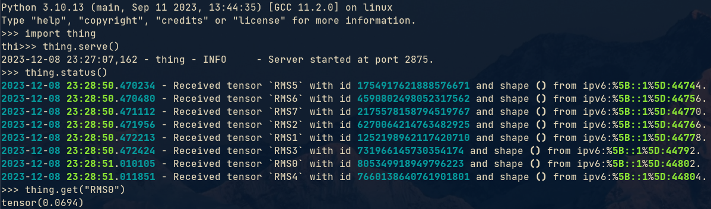

# thing
Catch your tensors in one program and quietly send to another live python session.


# How it works


# Quick start
Say, you have a neural network training script, and you just want to play with some tensors in a separate
python session, investigating the L2-norms, distributions, eigen-vectors, etc. in a live and interactive manner without
disturbing your training job.

## Client: catching the tensors
You can quickly modify your training code by inserting some `thing.catch(...)` as follows:
```python
import thing
import ... # your other imports
... # your codes
model = ... # you train some model
... # some more codes

for i in range(100):
    ... # your codes
    loss.backward()  # your backward pass
    optimizer.step()  # you applied your gradient
    
    # Now, it's show time:
    thing.catch(loss, name='loss', every=10)
    thing.catch(model.lm_head.weight, name='lm_head_weight', every=10)

... # your rest of the codes
```

## Server: receive and interact

Once the client is set up, in a separate python REPL or jupyter notebook, you can do

```python
import thing

thing.serve()
```
to spin up a server that listens to the client captures.

Once a tensor is received, you can play with it. 

### help()

First of all, the rest of the API can be seen when running `thing.help()`.

### status()

`thing.status()` will show you the current status with a spinner, but you don't need to run this in order to receive the tensors.

### summary()

```python
thing.summary()
```
organize the recent capture logs.

If you received the captures, try, for example,

```python
import thing

thing.get('lm_head_weight')
```
to obtain the captured tensor in your server session. It will not affect your training code and you can apply
whatever transformation you want to investigate further.


# Some use cases
Here is a screenshot when I was debugging FSDP. Just inserted some `thing.catch(...)` in the fsdp code and
captured some scalar tensors right after the all-gather.


# FAQ
- Q: Why not logging?

  A: Logging is great for standardized metrics and quantities. But in the case of debugging and research, there is 
  data (especially big tensors such as layer weights) that we prefer to interactively explore in a separate persistent
  session.
  Several examples of my own use cases:

  - Debugging a model implementation. Quickly catching intermediate variables, keep them in a persistent python
    session, check the shapes and do some sanity tests.
  - Silently catch the hidden states in a continuous training/inference job for some quick analysis.
  - Spin up a high-mem instance and receive model weights from an experimental training job. A small experiment can
    easily generate terabytes of checkpoints, and I'd rather put them on RAM for quick studies than saving
    to disk/pushing to blob storage.
  
- Q: Why not using pickle?

  A: Tensors can be huge. I'd rather stream bytes directly from the original buffer address than doing serialization
  and make a copy of the whole thing in RAM.

- Q: What to do if the server receiving tensors is on a different machine?
  
  A: A few ways:

  - `ssh` with reverse port-forwarding.
  - Try to set the environment variable `THING_SERVER=<your-own-ip>`.
  - In the client, specify `thing.catch(..., server='<your-ip>:<your-port>')`

- Q: What's the point of naming in: `.catch(..., name='...')`?

  A: A few things:
  - A name is not supposed to be a unique identifier of a transmission.
  - Several transmissions under the same name will have a chain of history on the server.
  - `thing.get_all(name)` returns a list of tensors, from oldest to latest.