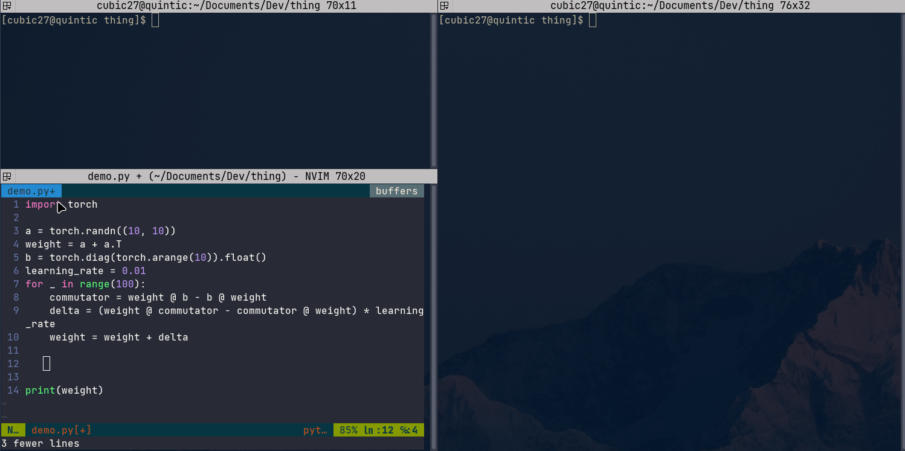

# thing


# How it works


# Quick start
Say, you have a neural network training script, and you just want to play with some tensors in a separate
python session, investigating the L2-norms, distributions, eigen-vectors, etc. in a live and interactive manner without
disturbing your training job.

You can insert client codes as follows:
```python
import thing
import ... # your other imports
... # your codes
model = ... # you train some model
... # some more codes

for i in range(100):
    ... # your codes
    loss.backward()  # your backward pass
    optimizer.step()  # you applied your gradient
    
    # Now, it's show time:
    thing.catch(loss, name='loss', every=10)
    thing.catch(model.lm_head.weight, name='lm_head_weight', every=10)

... # your rest of the codes
```

Then, in a separate python session, you can do
```python
import thing
thing.serve()
```
to spin up a server that listens to the client captures.

`thing.status()` will show you the current status, but you don't need to run it in order to receive the tensors.

Try
```python
thing.summary()
```
to get an idea about the recent captures from clients.

If you received the captures, do, for example,
```python
thing.get('loss')
```
to obtain the captured tensor in your server session. It will not affect your training code and you can apply
whatever transformation you want to investigate further.
